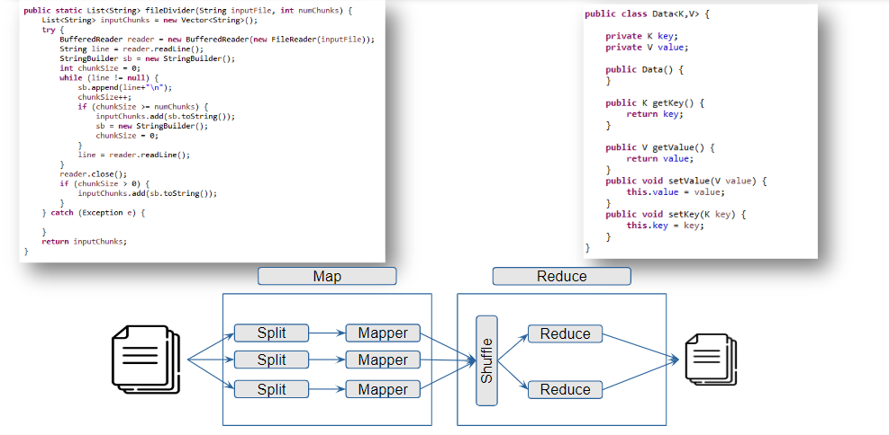
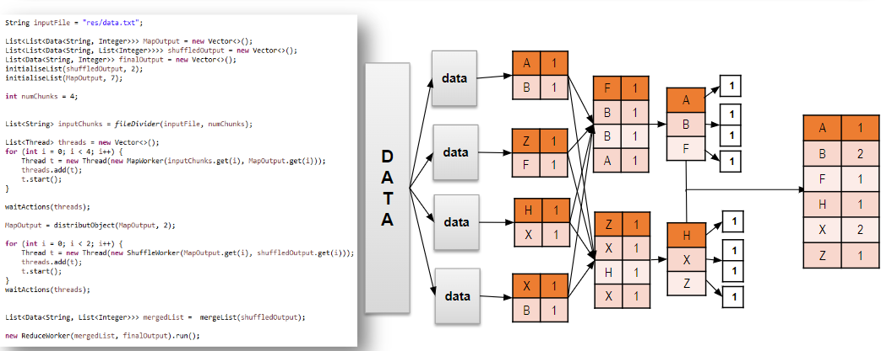

# MapReduce Example

## Overview

This project implements a basic MapReduce framework to process data using multithreading. The primary component is the `Test` class, which coordinates the execution of mapping, shuffling, and reducing tasks on an input file.


## Package Structure

```
org
 └── zzach
        └── mapreduce
            ├── example
            │    └── Test.java
            │    └── Main.java
            ├── models
            │    └── Data.java
            └── tasks
            │    ├── MapWorker.java
            │    ├── ReduceWorker.java
            │    └── ShuffleWorker.java
            └── utils
                 └── Common.java
```

## Classes

### `Test`

- The main class that initiates the MapReduce process.
- Reads data from `resources/data.txt`.
- Divides the data into chunks and distributes them to worker threads for processing.

### Key Methods

- `execution()`: Orchestrates the overall MapReduce workflow, including:

  - Dividing the input file into chunks.
  - Starting mapping tasks using `MapWorker`.
  - Shuffling intermediate results with `ShuffleWorker`.
  - Reducing the final output with `ReduceWorker`.

- `fileDivider(String inputFile, int numChunks)`: Divides the input file into a specified number of chunks.

- `distributObject(List<List<Data<String, Integer>>> arr, int nbrArr)`: Distributes data objects based on their keys.

- `mergeList(List<?> w)`: Merges lists of data.

- `initialiseList(List w, int num)`: Initializes a list with a specified number of empty vectors.

- `waitActions(List<Thread> threads)`: Waits for all threads to complete.

## Usage

**Compile the Project**: Ensure you have Java installed and set up. Compile the project using the provided build scripts.

```bash
cd ./MapReduce
./scripts/compile.sh
./scripts/run.sh
```

## Example Output

The output will display key-value pairs processed from the input file. For example:

```
la => 5
karma => 3
```


